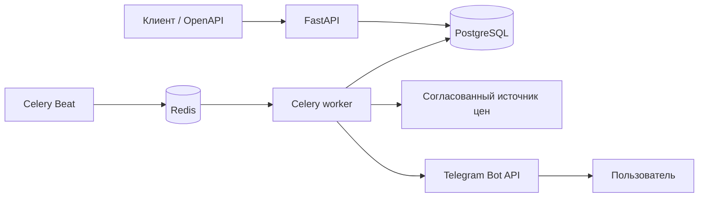

# Архитектура StockWatch

## Назначение

StockWatch — API для пользовательских отслеживаний цен. HTTP-запросы не ждут
внешние источники: создание и чтение данных обслуживает FastAPI, а периодические
проверки выполняет Celery.

## Компоненты

| Компонент | Ответственность |
| --- | --- |
| FastAPI | JWT-аутентификация, CRUD отслеживаний, история цен и настройка Telegram chat ID. |
| PostgreSQL | Пользователи, товары, отслеживания, неизменяемые снимки цен и журнал уведомлений. |
| Redis | Брокер и backend Celery. Не является источником бизнес-данных. |
| Celery Beat | Каждые пять минут ставит в очередь активные отслеживания. |
| Celery worker | Получает цену, создаёт снимок и запускает уведомление при пересечении порога. |
| Telegram adapter | Отправляет сообщение только при наличии `TELEGRAM_BOT_TOKEN` и chat ID пользователя. |

## Поток проверки цены

1. Beat получает идентификаторы активных отслеживаний и публикует задачи в Redis.
2. Worker получает URL товара через адаптер `PriceSource`.
3. Worker сохраняет `PriceSnapshot` независимо от того, достигнут ли целевой порог.
4. Если доступная цена стала не выше цели, а предыдущая цена была выше цели (или снимка не было), worker отправляет Telegram-сообщение и сохраняет `NotificationEvent`.
5. Пока цена остаётся ниже цели, новые сообщения не создаются. После возврата цены выше цели новое падение сформирует новое уведомление.

Временные ошибки источника цены и Telegram повторяются Celery с экспоненциальной задержкой до трёх раз.

## Границы и безопасность

- Пароли хранятся в виде Argon2-хеша; API использует access/refresh JWT.
- Все запросы к пользовательским данным отфильтрованы по текущему пользователю.
- Токен Telegram находится только в `.env` среды запуска или в секрете платформы развёртывания.
- Стандартный `UnsupportedPriceSource` ничего не парсит. Для настоящей проверки нужен отдельный адаптер разрешённого публичного источника.
- Закрытые и недокументированные API магазинов не используются.
